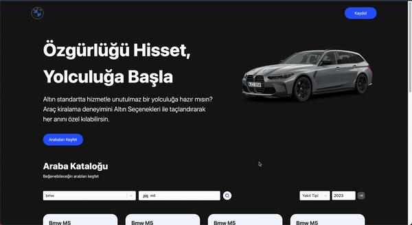

**Car Listing App** is a modern, responsive React application for exploring car models. Users can search and filter cars by model using an interactive interface, with data fetched in real-time from RapidAPI. The app also includes animations for a smooth and visually engaging experience.

## Features

- **Car Model Search & Filter**: Users can enter a car model to quickly filter through listings.
- **Real-time Data**: Car data is fetched dynamically from RapidAPI.
- **Animated UI**: Enhanced with **Framer Motion** for smooth transitions and animations.
- **Custom Styling**: Styled with **Tailwind CSS** for a modern, responsive layout.
- **Dropdown Selection**: Built with **React Select** for an intuitive and customizable dropdown experience.
- **Type Safety**: Implemented with **TypeScript** for better reliability and maintainability.
- **Routing**: Managed with **React Router DOM** for seamless navigation between pages.

## Technologies Used

- **React**: For building the user interface.
- **TypeScript**: Adds type safety to the codebase.
- **Framer Motion**: Animates page elements for enhanced user interaction.
- **React Select**: Provides dropdown selection functionality.
- **Axios**: For making API requests to fetch car data.
- **RapidAPI**: API provider for fetching car listing data.
- **Tailwind CSS**: Utility-first CSS framework for responsive design.
- **React Router DOM**: Handles navigation and routing within the app.

# car_rental-ts
